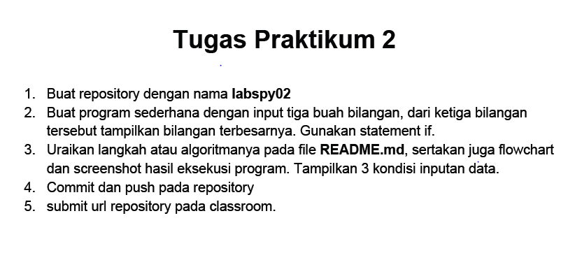
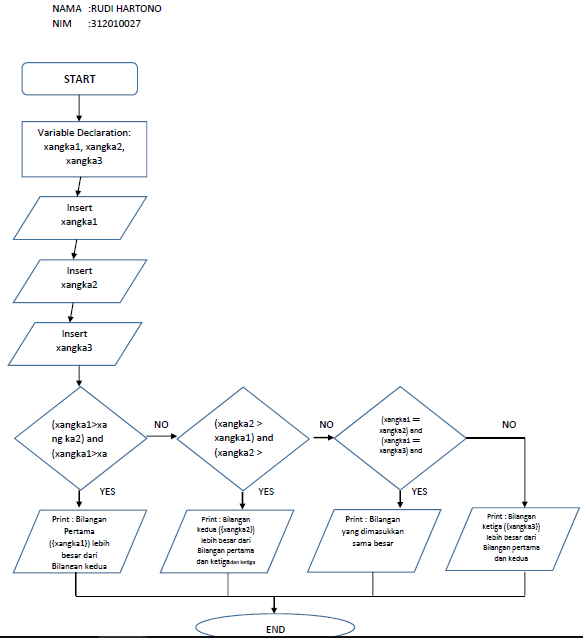
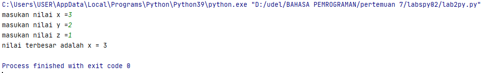
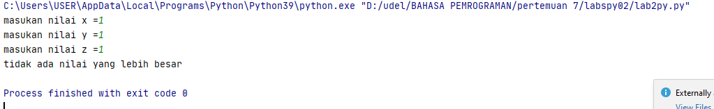

# labspy02
Nama    : Rudi Hartono<br>
Nim     : 312010027<br>

Tugas Pertemuan 7 <br>

1. Latihan 3

untuk memenuhi tugas latihan 3:


```python
#!/usr/bin/python3
a = int(input("Masukkan bilangan A: "))
b = int(input("Masukkan bilangan B: "))
c = int(input("Masukkan bilangan C: "))
if a+b == c or b+c == a or c+a == b:
 print("BENAR")
else:
 print("SALAH")
```

berikut adalah hasil dari pernyataan di atas:


2.lab2py

soal latihan lab2py



hasil penulisan flowchart sebagai berikut



```python
x=int(input("masukan nilai x ="))
y=int(input("masukan nilai y ="))
z=int(input("masukan nilai z ="))

if (x>y) and (x>z) :
    print(f"nilai terbesar adalah x = {x}")
elif (y>x) and (y>z) :
    print(f"nilai terbesar adalah y = {y}")
elif (z>x) and (z>y) :
    print(f"nilai terbesar adalah z = {z}")
else:
    print ("tidak ada nilai yang lebih besar")
```
hasil dari inputan tersebut menjadi sebuah output sebagai berikut :



hasil inputan dengan hasil output yang salah sebagai berikut :




TERIMAKASIH SEKIAN...


