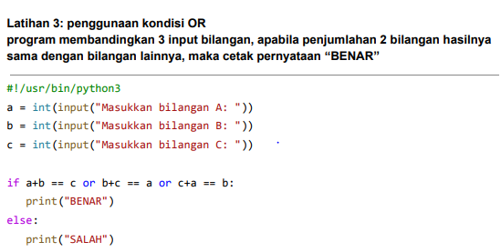
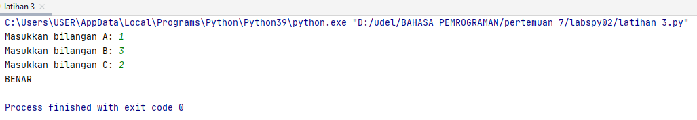

# labspy02
Nama    : Rudi Hartono<br>
Nim     : 312010027<br>

Tugas Pertemuan 7 <br>

1. Latihan 3

untuk memenuhi tugas latihan 3:



```python
#!/usr/bin/python3
a = int(input("Masukkan bilangan A: "))
b = int(input("Masukkan bilangan B: "))
c = int(input("Masukkan bilangan C: "))
if a+b == c or b+c == a or c+a == b:
 print("BENAR")
else:
 print("SALAH")
```

berikut adalah hasil dari pernyataan di atas:




